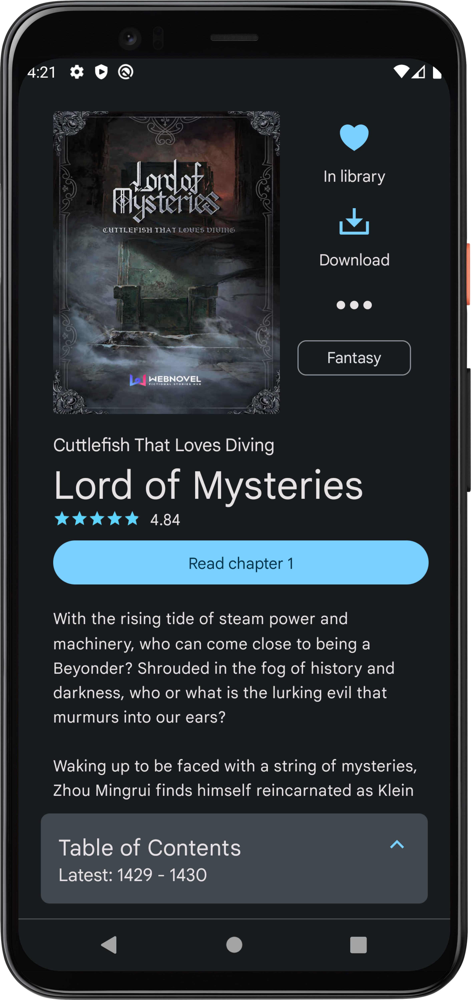
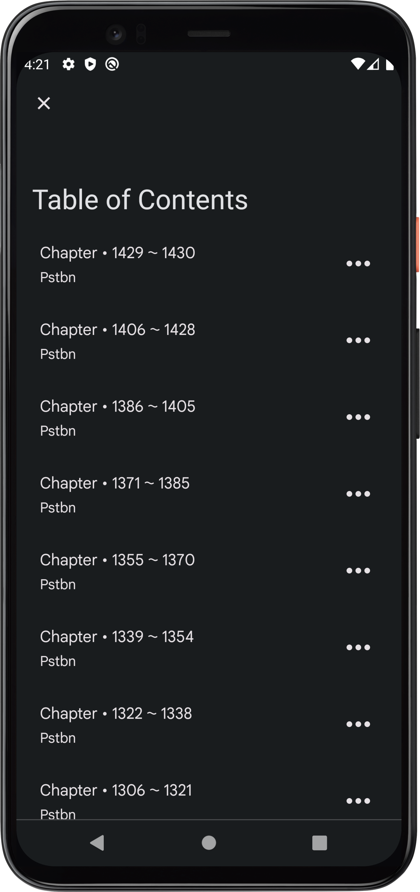

# 

A simple application intended provide extension to the capabilities of the website <https://toc.qidianunderground.org/>

## Features :sparkles:

- Access all the books available on the website
- Loads book information directly from WebNovel.com
- A builtin chapter reader optimized for reading on mobile devices
- Support for reading and saving non-premium chapters from WebNovel.com 
- Support for downloading books for offline reading
- Notifications service for book updates with multiple actions
- Bookmark progress on chapters
- Day/Night theme support (Requires Android P or above)
- Caching to allow offline content access

## Screenshots :camera:

| Views    | Dark                                                       | Light                                                        |
| -------- | ---------------------------------------------------------- | ------------------------------------------------------------ |
| Library  |          |          |
| Book     |                |                |
| Chapters |        |        |
| Article  |                |                |

## Project Milestones

Learn more about upcoming features and fixes

https://github.com/users/UbadahJ/projects/1

## Discussion

Jump into discussions on 

https://github.com/UbadahJ/QReader/discussions/
