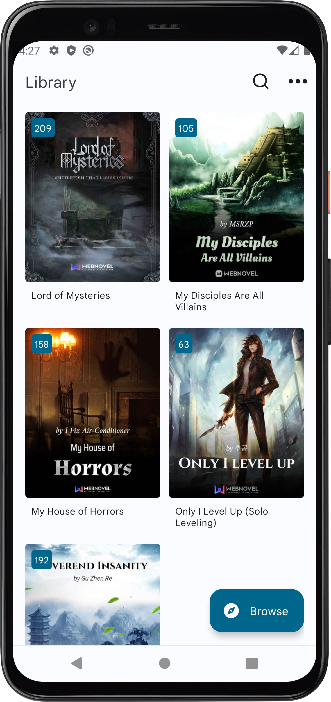

# Qidian Underground :books:

A simple application intended provide extension to the capabilities of the website <https://toc.qidianunderground.org/>

## Features :sparkles:

- Access all the books avaliable on the website
- A builtin chapter reader optimized for reading on mobile devices
- Notifications service for book updates
- Bookmark progress on chapters
- Day/Night theme support (Requires Android P or above)

## Screenshots :camera:

| Views    | Dark                                                       | Light                                                        |
| -------- | ---------------------------------------------------------- | ------------------------------------------------------------ |
| Library  |          |          |
| Book     |                |                |
| Chapters |  |  |

## Upcoming features :rocket:

- [ ] Improved caching to allow offline content access
- [ ] Improve notifications to allow opening chapters directly
- [ ] Per-chapter bookmark instead of chapter group
- [ ] Support for downloading books
- [ ] Book metadata support
