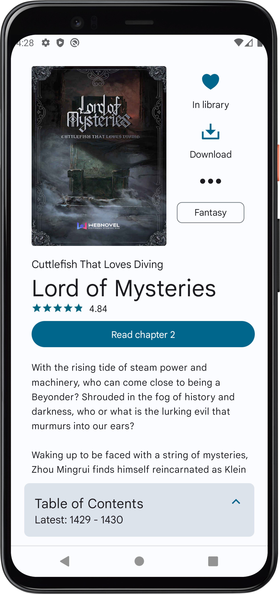
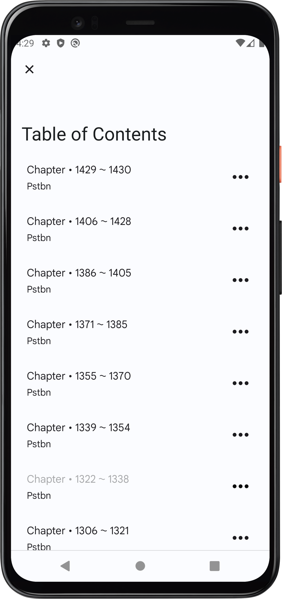
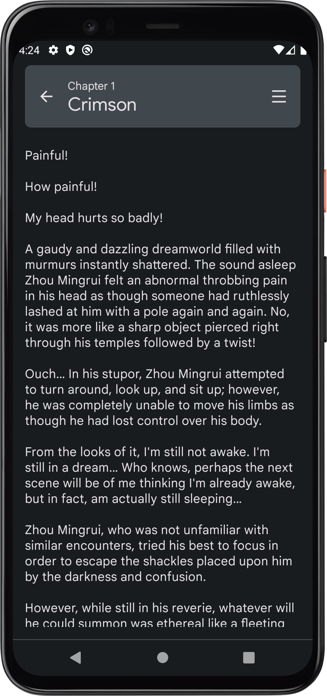

  

A simple application intended provide extension to the capabilities of the website <https://toc.qidianunderground.org/>

## Features :sparkles:

- Access all the books available on the website
- Loads book information directly from WebNovel.com
- A builtin chapter reader optimized for reading on mobile devices
- Support for reading and saving non-premium chapters from WebNovel.com 
- Support for downloading books for offline reading
- Notifications service for book updates with multiple actions
- Bookmark progress on chapters
- Day/Night theme support (Requires Android P or above)
- Caching to allow offline content access

## Screenshots :camera:

| Views    | Dark                                                       | Light                                                        |
| -------- | ---------------------------------------------------------- | ------------------------------------------------------------ |
| Library  |          |          |
| Book     |                |                |
| Chapters |        |        |
| Article  |                |                |

## Contributing

Contributions are what make the open source community such an amazing place to learn, inspire, and create. Any contributions you make are **greatly appreciated**.

If you have a suggestion that would make this better, please fork the repo and create a pull request. You can also simply open an issue with the tag "enhancement".
Don't forget to give the project a star! Thanks again!

1. Fork the Project
2. Create your Feature Branch (`git checkout -b feature/AmazingFeature`)
3. Commit your Changes (`git commit -m 'Add some AmazingFeature'`)
4. Push to the Branch (`git push origin feature/AmazingFeature`)
5. Open a Pull Request

## Project Milestones

Learn more about upcoming features and fixes

https://github.com/users/UbadahJ/projects/1

## Discussion

Jump into discussions on 

https://github.com/UbadahJ/QReader/discussions/
